# TDKwarriors — WRO Future Engineers 2026

Welcome to the official repository of **Team TDKwarriors** for **WRO Future Engineers 2026**.

This repository contains the current public documentation of our autonomous robot car project for the 2026 season.

## Team

- **Mussabek Nurtas**
- **Mukhtar Gulsim**

## Team Photo

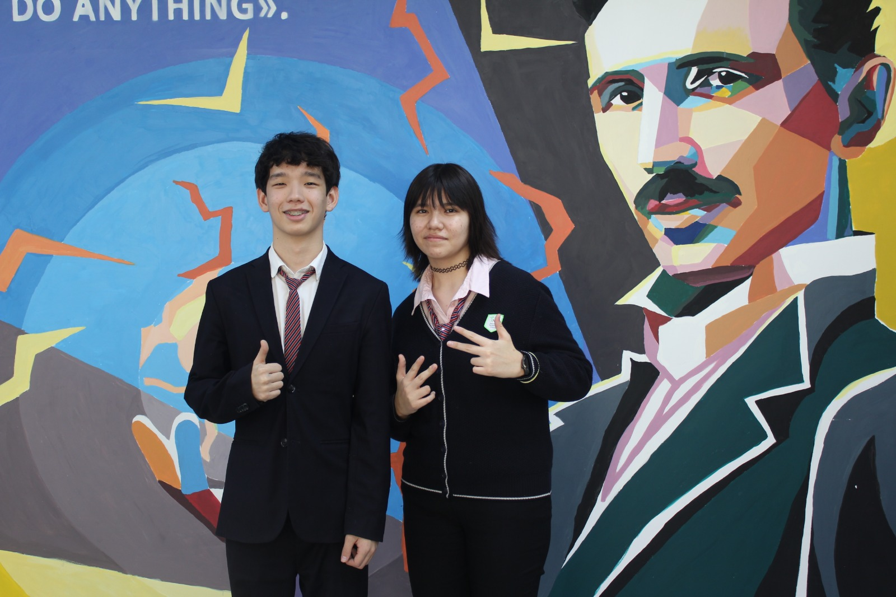

## Project Overview

Our project is a compact autonomous robot car built for the **WRO Future Engineers** category.

The robot is designed to complete both competition tasks:

- **Open Challenge** — complete 3 autonomous laps on the track
- **Obstacle Challenge** — detect red and green pillars, pass on the correct side, complete 3 laps, and perform parking

At the current stage, the robot includes:

- front-mounted **OpenMV camera**
- **three distance sensors** (left, front, right)
- steering and rear drive system
- compact LEGO Technic-based vehicle platform
- early flowcharts and software state-machine documentation

## Robot Photos

### Front View
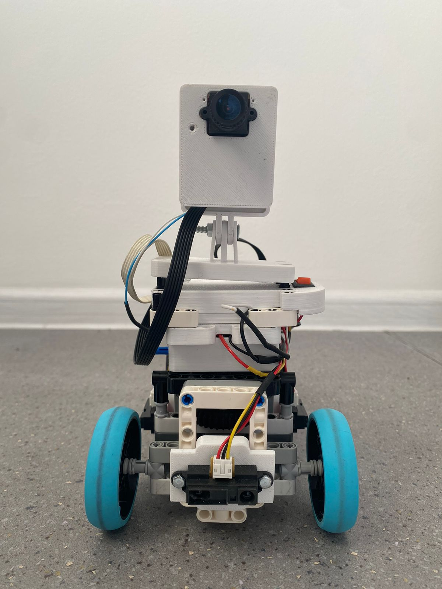

### Back View
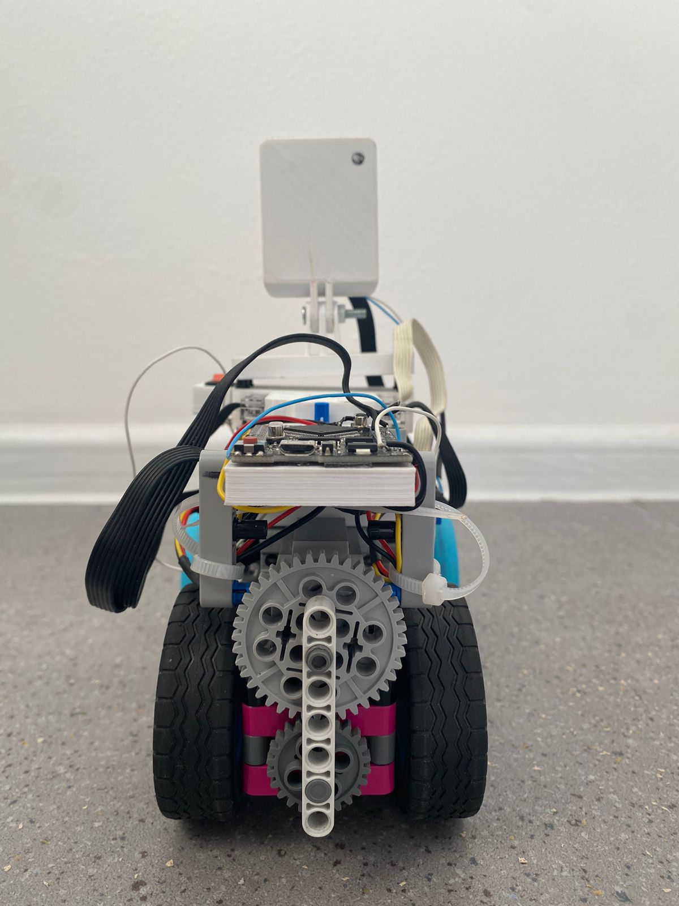

### Left View
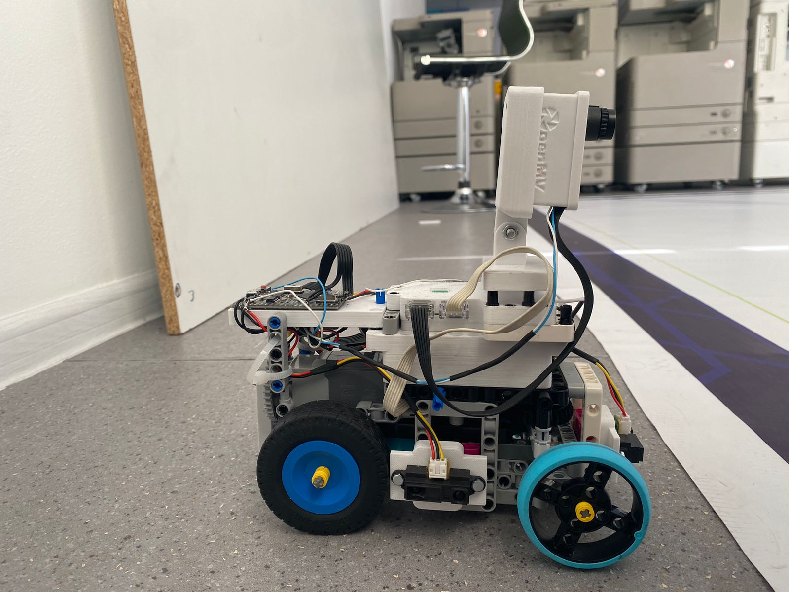

### Right View
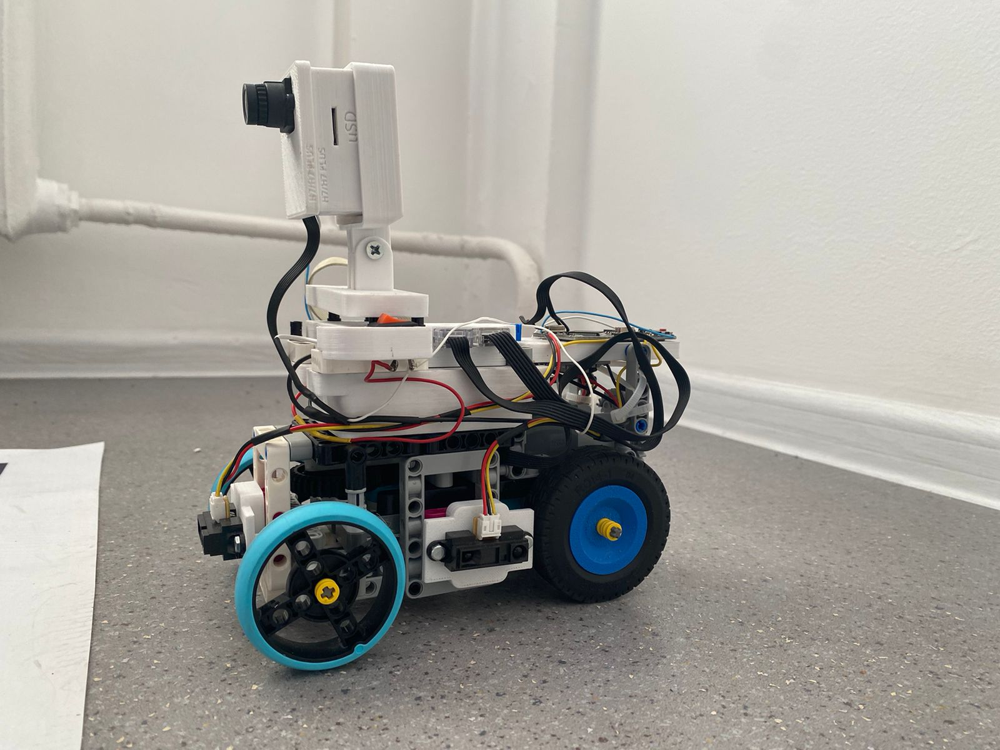

### Top View
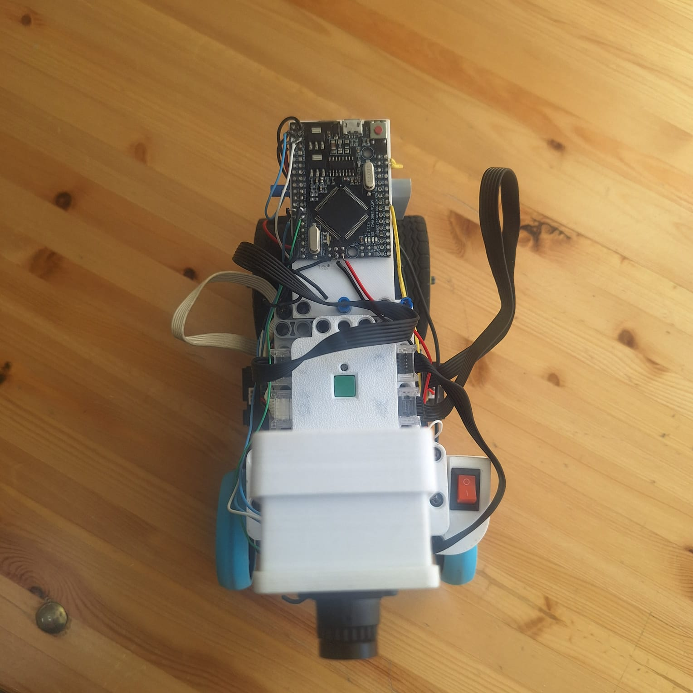

### Bottom View
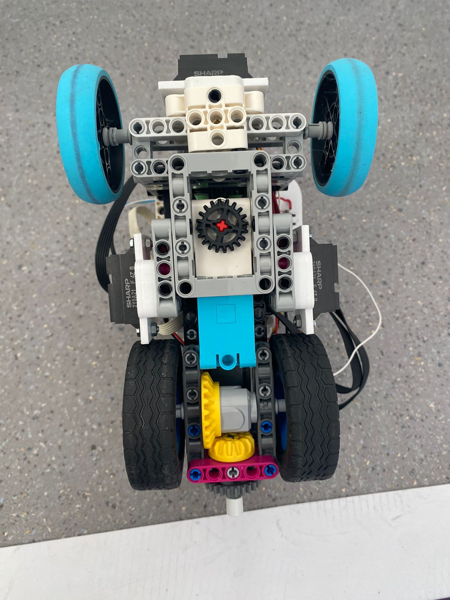

## Sensor Placement

The robot currently uses:

- **OpenMV camera**
- **left distance sensor**
- **front distance sensor**
- **right distance sensor**

The current placement of the camera and sensors is shown below:

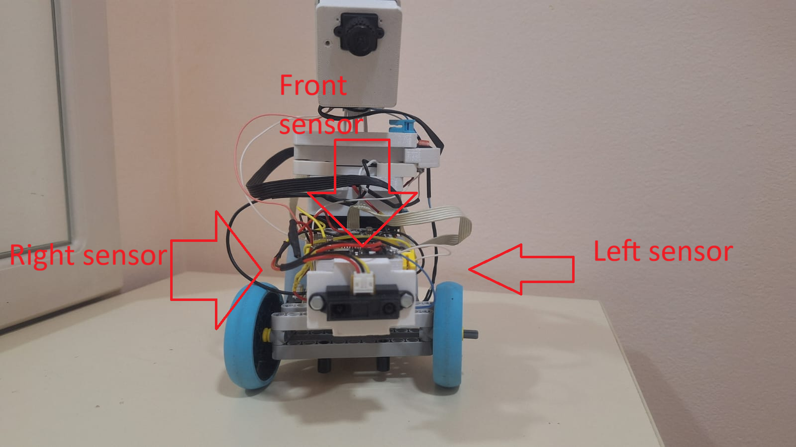

## Open Challenge Flow

The current Open Challenge logic is:

1. Detect track or walls
2. Follow lane or path
3. Complete 3 laps
4. Stop in the finish section

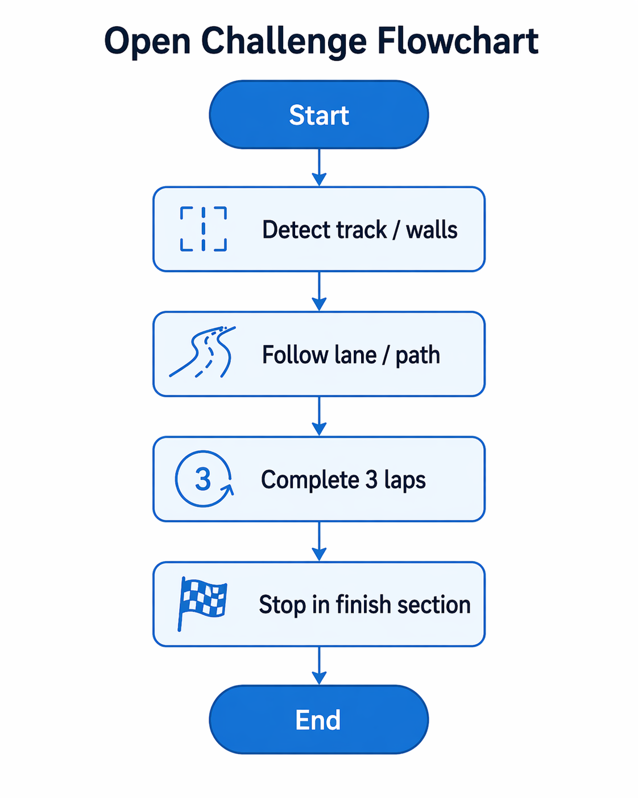

## Obstacle Challenge Flow

The current Obstacle Challenge logic is:

1. Detect red or green pillar
2. Choose the correct passing side
3. Avoid obstacle
4. Recover to lane
5. Complete 3 laps
6. Search for parking
7. Perform parallel parking

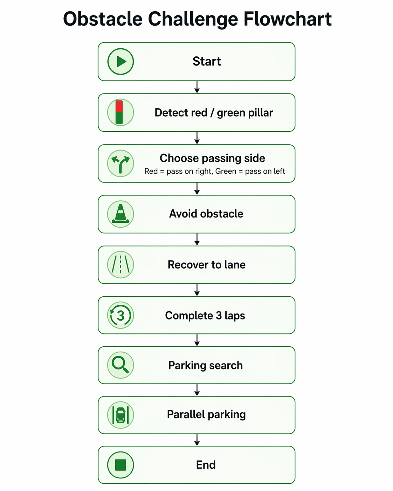

## Software State Machine

The current software is organized around the following main states:

- `INIT`
- `CALIBRATE`
- `WAIT_CAMERA`
- `DRIVE`
- `DETECT`
- `AVOID`
- `RECOVER`
- `FINISH`

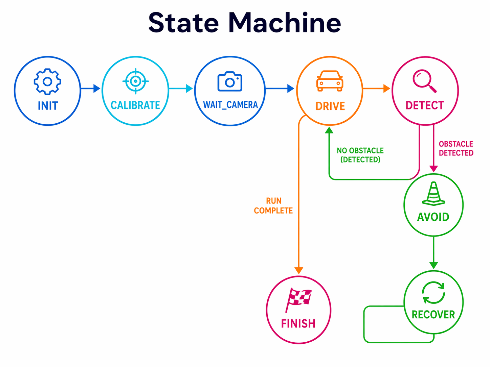

## Current Hardware Summary

The robot currently includes:

- LEGO Technic chassis
- rear drive motor
- front steering motor
- OpenMV camera
- three distance sensors
- onboard electronics and custom mounts

## Current Repository Status

This repository currently contains:

- robot photos
- team photo
- challenge flowcharts
- software state machine
- sensor placement image

More technical documentation will be added later, including:

- wiring diagram
- chassis diagram
- detailed software architecture
- testing metrics
- engineering decisions
- full reproducibility notes

## Goal of This Repository

The purpose of this repository is to document the development of our WRO Future Engineers 2026 robot and show the current progress of our engineering work.
